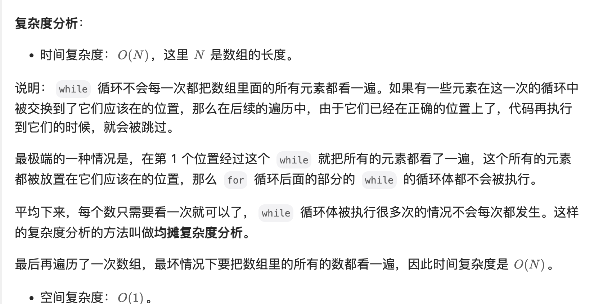

[41. 缺失的第一个正数](https://leetcode.cn/problems/first-missing-positive/)

困难

相关企业

给你一个未排序的整数数组 `nums` ，请你找出其中没有出现的最小的正整数。

请你实现时间复杂度为 `O(n)` 并且只使用常数级别额外空间的解决方案。

 

**示例 1：**

```
输入：nums = [1,2,0]
输出：3
```

**示例 2：**

```
输入：nums = [3,4,-1,1]
输出：2
```

**示例 3：**

```
输入：nums = [7,8,9,11,12]
输出：1
```

 

**提示：**

- `1 <= nums.length <= 5 * 105`
- `-231 <= nums[i] <= 231 - 1`


解法1: 空间复杂度 O（N)

```java
    public int firstMissingPositive(int[] nums) {
        int len = nums.length + 1;
        byte[] arr = new byte[len];
        for (int num : nums) {
            if (num > 0 && num < len) {
                arr[num-1] = 1;
            }
        }
        for (int i = 0; i < len; i++) {
            if (arr[i] == 0) {
                return i+1;
            }
        }
        return len;
    }

作者：翘课小皮球
链接：https://leetcode.cn/problems/first-missing-positive/solutions/2391958/fei-chang-jian-dan-de-jie-fa-ge-ju-da-ka-y71b/
来源：力扣（LeetCode）
著作权归作者所有。商业转载请联系作者获得授权，非商业转载请注明出处。
```


解法2:  将数组视为哈希表
最早知道这个思路是在《剑指 Offe》这本书上看到的，感兴趣的朋友不妨做一下这道问题：剑指 Offer 03. 数组中重复的数字。下面简要叙述：

由于题目要求我们「只能使用常数级别的空间」，而要找的数一定在 [1, N + 1] 左闭右闭（这里 N 是数组的长度）这个区间里。因此，我们可以就把原始的数组当做哈希表来使用。事实上，哈希表其实本身也是一个数组；
我们要找的数就在 [1, N + 1] 里，最后 N + 1 这个元素我们不用找。因为在前面的 N 个元素都找不到的情况下，我们才返回 N + 1；
那么，我们可以采取这样的思路：就把 111 这个数放到下标为 000 的位置， 222 这个数放到下标为 111 的位置，按照这种思路整理一遍数组。然后我们再遍历一次数组，第 111 个遇到的它的值不等于下标的那个数，就是我们要找的缺失的第一个正数。
这个思想就相当于我们自己编写哈希函数，这个哈希函数的规则特别简单，那就是数值为 i 的数映射到下标为 i - 1 的位置。

作者：liweiwei1419
链接：https://leetcode.cn/problems/first-missing-positive/solutions/7703/tong-pai-xu-python-dai-ma-by-liweiwei1419/
来源：力扣（LeetCode）
著作权归作者所有。商业转载请联系作者获得授权，非商业转载请注明出处。

```java
public class Solution {

    public int firstMissingPositive(int[] nums) {
        int len = nums.length;

        for (int i = 0; i < len; i++) {
            while (nums[i] > 0 && nums[i] <= len && nums[nums[i] - 1] != nums[i]) {
                // 满足在指定范围内、并且没有放在正确的位置上，才交换
                // 例如：数值 3 应该放在索引 2 的位置上
                swap(nums, nums[i] - 1, i);
            }
        }

        // [1, -1, 3, 4]
        for (int i = 0; i < len; i++) {
            if (nums[i] != i + 1) {
                return i + 1;
            }
        }
        // 都正确则返回数组长度 + 1
        return len + 1;
    }

    private void swap(int[] nums, int index1, int index2) {
        int temp = nums[index1];
        nums[index1] = nums[index2];
        nums[index2] = temp;
    }
}

作者：liweiwei1419
链接：https://leetcode.cn/problems/first-missing-positive/solutions/7703/tong-pai-xu-python-dai-ma-by-liweiwei1419/
来源：力扣（LeetCode）
著作权归作者所有。商业转载请联系作者获得授权，非商业转载请注明出处。
```




