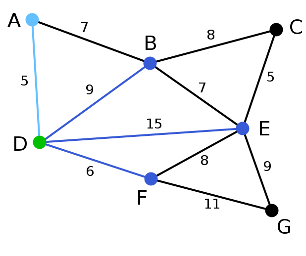
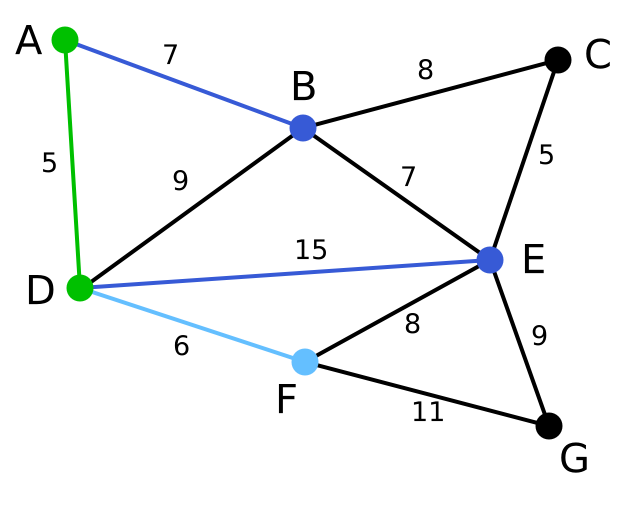
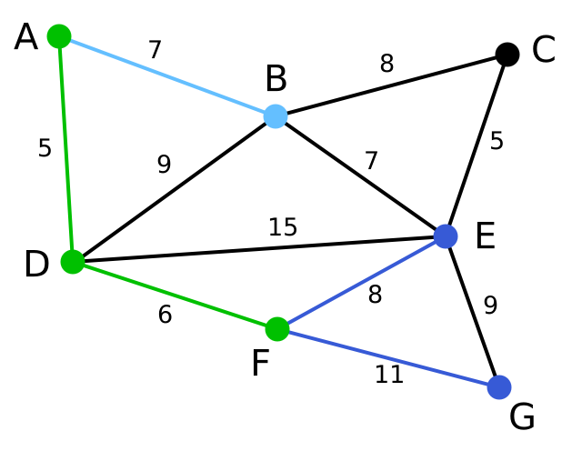
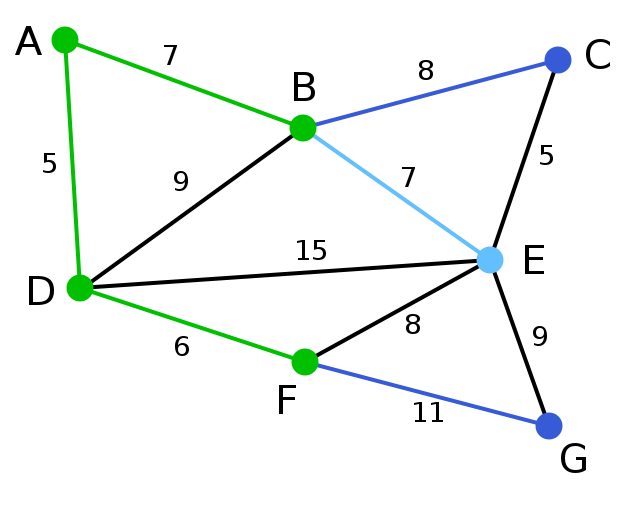

## [最小生成树-Prim算法和Kruskal算法](https://www.cnblogs.com/biyeymyhjob/archive/2012/07/30/2615542.html)

 

**Prim算法**

**1.概览**

**普里姆算法**（Prim算法），图论中的一种算法，可在加权连通图里搜索最小生成树。意即由此算法搜索到的边子集所构成的树中，不但包括了连通图里的所有顶点（英语：Vertex (graph theory)），且其所有边的权值之和亦为最小。该算法于1930年由捷克数学家沃伊捷赫·亚尔尼克（英语：Vojtěch Jarník）发现；并在1957年由美国计算机科学家罗伯特·普里姆（英语：Robert C. Prim）独立发现；1959年，艾兹格·迪科斯彻再次发现了该算法。因此，在某些场合，普里姆算法又被称为DJP算法、亚尔尼克算法或普里姆－亚尔尼克算法。

 

**2.算法简单描述**

1).输入：一个加权连通图，其中顶点集合为V，边集合为E；

2).初始化：Vnew = {x}，其中x为集合V中的任一节点（起始点），Enew = {},为空；

3).重复下列操作，直到Vnew = V：

a.在集合E中选取权值最小的边<u, v>，其中u为集合Vnew中的元素，而v不在Vnew集合当中，并且v∈V（如果存在有多条满足前述条件即具有相同权值的边，则可任意选取其中之一）；

b.将v加入集合Vnew中，将<u, v>边加入集合Enew中；

4).输出：使用集合Vnew和Enew来描述所得到的最小生成树。

 

下面对算法的图例描述

| 图例                                                         | 说明                                                         | 不可选 | 可选       | 已选（Vnew）        |
| ------------------------------------------------------------ | ------------------------------------------------------------ | ------ | ---------- | ------------------- |
|                                | 此为原始的加权连通图。每条边一侧的数字代表其权值。           | -      | -          | -                   |
|                                | 顶点**D**被任意选为起始点。顶点**A**、**B**、**E**和**F**通过单条边与**D**相连。**A**是距离**D**最近的顶点，因此将**A**及对应边**AD**以高亮表示。 | C, G   | A, B, E, F | D                   |
|                                | 下一个顶点为距离**D**或**A**最近的顶点。**B**距**D**为9，距**A**为7，**E**为15，**F**为6。因此，**F**距**D**或**A**最近，因此将顶点**F**与相应边**DF**以高亮表示。 | C, G   | B, E, F    | A, D                |
|                                | 算法继续重复上面的步骤。距离**A**为7的顶点**B**被高亮表示。  | C      | B, E, G    | A, D, F             |
|                                | 在当前情况下，可以在**C**、**E**与**G**间进行选择。**C**距**B**为8，**E**距**B**为7，**G**距**F**为11。**E**最近，因此将顶点**E**与相应边**BE**高亮表示。 | 无     | C, E, G    | A, D, F, B          |
|  | 这里，可供选择的顶点只有**C**和**G**。**C**距**E**为5，**G**距**E**为9，故选取**C**，并与边**EC**一同高亮表示。 | 无     | C, G       | A, D, F, B, E       |
|  | 顶点**G**是唯一剩下的顶点，它距**F**为11，距**E**为9，**E**最近，故高亮表示**G**及相应边**EG**。 | 无     | G          | A, D, F, B, E, C    |
|  | 现在，所有顶点均已被选取，图中绿色部分即为连通图的最小生成树。在此例中，最小生成树的权值之和为39。 | 无     | 无         | A, D, F, B, E, C, G |

 

**3.简单证明prim算法**

反证法：假设prim生成的不是最小生成树

1).设prim生成的树为G0

2).假设存在Gmin使得cost(Gmin)<cost(G0)  则在Gmin中存在<u,v>不属于G0

3).将<u,v>加入G0中可得一个环，且<u,v>不是该环的最长边(这是因为<u,v>∈Gmin)

4).这与prim每次生成最短边矛盾

5).故假设不成立，命题得证.

 

 

 **4.算法代码实现(未检验)**

[](javascript:void(0);)

```
#define MAX  100000
#define VNUM  10+1                                             //这里没有ID为0的点,so id号范围1~10

int edge[VNUM][VNUM]={/*输入的邻接矩阵*/};
int lowcost[VNUM]={0};                                         //记录Vnew中每个点到V中邻接点的最短边
int addvnew[VNUM];                                             //标记某点是否加入Vnew
int adjecent[VNUM]={0};                                        //记录V中与Vnew最邻近的点


void prim(int start)
{
     int sumweight=0;
     int i,j,k=0;

     for(i=1;i<VNUM;i++)                                      //顶点是从1开始
     {
        lowcost[i]=edge[start][i];
        addvnew[i]=-1;                                         //将所有点至于Vnew之外,V之内，这里只要对应的为-1，就表示在Vnew之外
     }

     addvnew[start]=0;                                        //将起始点start加入Vnew
     adjecent[start]=start;
                                                 
     for(i=1;i<VNUM-1;i++)                                        
     {
        int min=MAX;
        int v=-1;
        for(j=1;j<VNUM;j++)                                      
        {
            if(addvnew[j]!=-1&&lowcost[j]<min)                 //在Vnew之外寻找最短路径
            {
                min=lowcost[j];
                v=j;
            }
        }
        if(v!=-1)
        {
            printf("%d %d %d\n",adjecent[v],v,lowcost[v]);
            addvnew[v]=0;                                      //将v加Vnew中

            sumweight+=lowcost[v];                             //计算路径长度之和
            for(j=1;j<VNUM;j++)
            {
                if(addvnew[j]==-1&&edge[v][j]<lowcost[j])      
                {
                    lowcost[j]=edge[v][j];                     //此时v点加入Vnew 需要更新lowcost
                    adjecent[j]=v;                             
                }
            }
        }
    }
    printf("the minmum weight is %d",sumweight);
}
```

[](javascript:void(0);)

 

**5.时间复杂度**

这里记顶点数v，边数e

邻接矩阵:O(v2)         邻接表:O(elog2v)

 

 

 

**Kruskal算法**

 

**1.概览**

**Kruskal算法**是一种用来寻找最小生成树的算法，由Joseph Kruskal在1956年发表。用来解决同样问题的还有Prim算法和Boruvka算法等。三种算法都是贪婪算法的应用。和Boruvka算法不同的地方是，Kruskal算法在图中存在相同权值的边时也有效。

 

**2.算法简单描述**

1).记Graph中有v个顶点，e个边

2).新建图Graphnew，Graphnew中拥有原图中相同的e个顶点，但没有边

3).将原图Graph中所有e个边按权值从小到大排序

4).循环：从权值最小的边开始遍历每条边 直至图Graph中所有的节点都在同一个连通分量中

​        if 这条边连接的两个节点于图Graphnew中不在同一个连通分量中

​                     添加这条边到图Graphnew中

 

图例描述：

首先第一步，我们有一张图Graph，有若干点和边 


 

将所有的边的长度排序，用排序的结果作为我们选择边的依据。这里再次体现了贪心算法的思想。资源排序，对局部最优的资源进行选择，排序完成后，我们率先选择了边AD。这样我们的图就变成了右图

 

 

 

在剩下的变中寻找。我们找到了CE。这里边的权重也是5

依次类推我们找到了6,7,7，即DF，AB，BE。


下面继续选择， BC或者EF尽管现在长度为8的边是最小的未选择的边。但是现在他们已经连通了（对于BC可以通过CE,EB来连接，类似的EF可以通过EB,BA,AD,DF来接连）。所以不需要选择他们。类似的BD也已经连通了（这里上图的连通线用红色表示了）。

最后就剩下EG和FG了。当然我们选择了EG。最后成功的图就是右：

 

 

 

**3.简单证明Kruskal算法**

对图的顶点数n做归纳，证明Kruskal算法对任意n阶图适用。

**归纳基础：**

n=1，显然能够找到最小生成树。

**归纳过程：**

假设Kruskal算法对n≤k阶图适用，那么，在k+1阶图G中，我们把最短边的两个端点a和b做一个合并操作，即把u与v合为一个点v'，把原来接在u和v的边都接到v'上去，这样就能够得到一个k阶图G'(u,v的合并是k+1少一条边)，G'最小生成树T'可以用Kruskal算法得到。

我们证明T'+{<u,v>}是G的最小生成树。

用反证法，如果T'+{<u,v>}不是最小生成树，最小生成树是T，即W(T)<W(T'+{<u,v>})。显然T应该包含<u,v>，否则，可以用<u,v>加入到T中，形成一个环，删除环上原有的任意一条边，形成一棵更小权值的生成树。而T-{<u,v>}，是G'的生成树。所以W(T-{<u,v>})<=W(T')，也就是W(T)<=W(T')+W(<u,v>)=W(T'+{<u,v>})，产生了矛盾。于是假设不成立，T'+{<u,v>}是G的最小生成树，Kruskal算法对k+1阶图也适用。

由数学归纳法，Kruskal算法得证。

 

 

 

**4.代码算法实现**

[](javascript:void(0);)

```
typedef struct          
{        
    char vertex[VertexNum];                                //顶点表         
    int edges[VertexNum][VertexNum];                       //邻接矩阵,可看做边表         
    int n,e;                                               //图中当前的顶点数和边数         
}MGraph; 
 
typedef struct node  
{  
    int u;                                                 //边的起始顶点   
    int v;                                                 //边的终止顶点   
    int w;                                                 //边的权值   
}Edge; 

void kruskal(MGraph G)  
{  
    int i,j,u1,v1,sn1,sn2,k;  
    int vset[VertexNum];                                    //辅助数组，判定两个顶点是否连通   
    int E[EdgeNum];                                         //存放所有的边   
    k=0;                                                    //E数组的下标从0开始   
    for (i=0;i<G.n;i++)  
    {  
        for (j=0;j<G.n;j++)  
        {  
            if (G.edges[i][j]!=0 && G.edges[i][j]!=INF)  
            {  
                E[k].u=i;  
                E[k].v=j;  
                E[k].w=G.edges[i][j];  
                k++;  
            }  
        }  
    }     
    heapsort(E,k,sizeof(E[0]));                            //堆排序，按权值从小到大排列       
    for (i=0;i<G.n;i++)                                    //初始化辅助数组   
    {  
        vset[i]=i;  
    }  
    k=1;                                                   //生成的边数，最后要刚好为总边数   
    j=0;                                                   //E中的下标   
    while (k<G.n)  
    {   
        sn1=vset[E[j].u];  
        sn2=vset[E[j].v];                                  //得到两顶点属于的集合编号   
        if (sn1!=sn2)                                      //不在同一集合编号内的话，把边加入最小生成树   
        {
            printf("%d ---> %d, %d",E[j].u,E[j].v,E[j].w);       
            k++;  
            for (i=0;i<G.n;i++)  
            {  
                if (vset[i]==sn2)  
                {  
                    vset[i]=sn1;  
                }  
            }             
        }  
        j++;  
    }  
}  
```

[](javascript:void(0);)


时间复杂度：elog2e e为图中的边数


