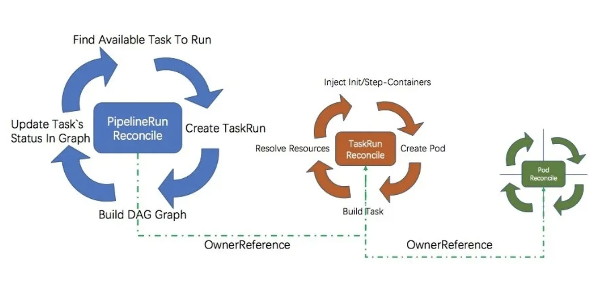
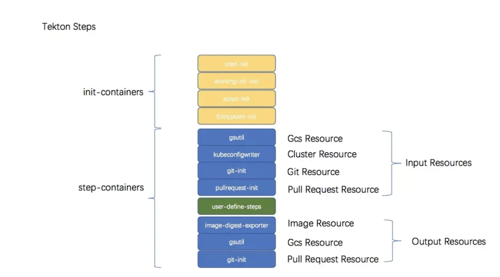

# 流水线引擎tekton介绍

Tekton 是一个 Kubernetes 原生的构建 CI/CD Pipeline 的解决方案，能够以 Kubernetes 扩展的方式安装和运行。它提供了一组 Kubernetes 自定义资源（custom resource），借助这些自定义资源，我们可以为 Pipeline 创建和重用构建块。


**相关概念**

Tekton 最主要的四个概念为：Task、TaskRun、Pipeline 以及 PipelineRun。


- **Task**: Task 为构建任务，是 Tekton 中不可分割的最小单位，正如同 Pod 在 Kubernetes 中的概念一样。在 Task 中，可以有多个 Step，每个 Step 由一个 Container 来执行。

- **Pipeline**: Pipeline 由一个或多个 Task 组成。在 Pipeline 中，用户可以定义这些 Task 的执行顺序以及依赖关系来组成 DAG（有向无环图）。

- **PipelineRun**: PipelineRun 是 Pipeline 的实际执行产物，当用户定义好 Pipeline 后，可以通过创建 PipelineRun 的方式来执行流水线，并生成一条流水线记录。

- **TaskRun**: PipelineRun 被创建出来后，会对应 Pipeline 里面的 Task 创建各自的 TaskRun。一个 TaskRun 控制一个 Pod，Task 中的 Step 对应 Pod 中的 Container。当然，TaskRun 也可以单独被创建。

  

### 社区开源tekton落地生产还有许多不足，Lstack做了如下优化

1. 流水线运行记录转储：由于面向 k8s 的设计，tekton 所有的实例数据都只存在 etcd 上，面临着 pod 数据会被gc和集群稳定性等风险。我们基于社区result api方案深度改写，将流水线历史记录存储到sql数据库中实现持久化，释放集群资源。

2. 构建日志上云：原生tekton流水线日志展示的是集群中pod的日志，而流水线每次运行都会产生大量pod，运行过多将导致资源被迅速耗尽。我们通过自己实现日志代理完成流水线日志的收集与上报，释放集群资源。

3. 编译性能提升：每次构建时,会把下载依赖包缓存起来,以后构建无需重复拉取,可有效提高构建速度。

4. 自定义流水线语法：重新定义一套yaml流水线语法，提高扩展性，使得流水线可交由多种ci/cd引擎来解释执行。例如在k8s上使用tekton来运行。

5. 丰富的模版：提供多语言、多流程的原子模版，例如门禁、通知等

6. 指标可视化：流水线每次运行都会上报指标


### 实现原理

Tekton 利用 Kubernetes 的 List-Watch 机制，在启动时初始化了 2 个 Controller、PipelineRunController 和 TaskRunController 。


PipelineRunController 监听 PipelineRun 对象的变化。在它的 reconcile 逻辑中，将 pipeline 中所有的 Task 构建为一张有向无环图(DAG)，通过遍历 DAG 找到当前可被调度的 Task 节点创建对应的 TaskRun 对象。


TaskRunController 监听 TaskRun 对象的变化。在它的 reconcile 逻辑中将 TaskRun 和对应 Task 转化为可执行的 Pod ，由 kubernetes 调度执行。利用 Kubernetes 的 OwnerReference 机制， PipelineRun Own TaskRun、TaskRun Own Pod、Pod 状态变更时，触发 TaskRun 的 reconcile 逻辑， TaskRun 状态变更时触发 PipelineRun 的 reconcile 逻辑。



**DAG 支持**


Tekton 对 DAG 的支持相对比较简单。在 Tekton 中一个 Pipeline 就是一张 DAG ，Pipeline 中的多个 Task 可是 DAG 中的节点。Task 默认并发执行，可以通过 RunAfter 和 From 关键字控制执行顺序。


Example:

```yaml
- name: lint-repo
  taskRef:
    name: pylint
  resources:
    inputs:
      - name: workspace
        resource: my-repo
- name: test-app
  taskRef:
    name: make-test
  resources:
    inputs:
      - name: workspace
        resource: my-repo
- name: build-app
  taskRef:
    name: kaniko-build-app
  runAfter:
    - test-app
  resources:
    inputs:
      - name: workspace
        resource: my-repo
    outputs:
      - name: image
        resource: my-app-image
- name: build-frontend
  taskRef:
    name: kaniko-build-frontend
  runAfter:
    - test-app
  resources:
    inputs:
      - name: workspace
        resource: my-repo
    outputs:
      - name: image
        resource: my-frontend-image
- name: deploy-all
  taskRef:
    name: deploy-kubectl
  resources:
    inputs:
      - name: my-app-image
        resource: my-app-image
        from:
          - build-app
      - name: my-frontend-image
        resource: my-frontend-image
        from:
          - build-frontend
```


渲染出的执行顺序为：

```
        |            |
        v            v
     test-app    lint-repo
    /        \
   v          v
build-app  build-frontend
   \          /
    v        v
    deploy-all

```


相比于 Argo 等专注在 workflow 的项目而言， Tekton 支持的任务编排方式是非常有限的。常见的循环，递归，重试，超时等待等策略都是没有的。


**条件判断**

Tekton 支持 condition 关键字来进行条件判断。Condtion 只支持判断当前 Task 是否执行，不能作为 DAG 的分支条件来进行动态 DAG 的渲染。

condition：

https://github.com/tektoncd/pipeline/blob/e2755583d52ae46907790d40ba4886d55611cd23/docs/conditions.md

```
* condition检查失败(exitCode != 0)，task不会被执行，pipelineRun状态不会因为condition检查失败而失败。
* 多个条件之间 “与” 逻辑关系

```


### PipelineResource 在 Task 间数据交换

作为 CI/CD 的工具，代码在什么时候 Clone 到 WorkSpace 中，如何实现的？ Tekton 中抽象了 PipelineResource 进行任务之间的数据交换， GitResource 是其中最基础的一种。用法如下。


声明一个 Git 类型的 PipelineResource :

```yaml
kind: PipelineResource
metadata:
  name: skaffold-git-build-push-kaniko
spec:
  type: git
  params:
  - name: revision
    value: v0.32.0
  - name: url
    value: https://github.com/GoogleContainerTools/skaffold

```

在 Task 中引用这个 Resource 做为输入：

```yaml
kind: Task
metadata:
  name: build-push-kaniko
spec:
  inputs:
    resources:
    - name: workspace
      type: git
  steps:
  - name: build-and-push
    image: registry.cn-shanghai.aliyuncs.com/kaniko-project-edas/executor:v0.17.1

```


代码会被 clone 在 /workspace 目录。


Tekton 是如何处理这些 PipelineResource 的呢，这就要从 Taskrun Controller 如何创建 Pod 说起。


Tekton 中一个 TaskRun 对应一个 Pod ，每个 Pod 有一系列 init-containers 和 step-containers 组成。 init-container 中完成认证信息初始化， workspace 目录初始化等初始化工作。


在处理 step-container 时，会根据这个 Task 引用的资源 Append 或者 Insert 一个 step-container 来处理对应的输和输出，如下图所示。





**Task 中 Step 执行顺序控制**


Tekton 源自 Knative Build ，在 Knative Build 中使用 Init-container 来串联 Steps 保证 Steps 顺序执行，在上面的分析中我们知道 Tekton 是用 Containers 来执行 Steps ， Pod 的 Containers 是并行执行的， Tekton 是如何保证 Steps 执行顺序呢？


这是一个 TaskRun 创建的 Pod 的部分描述信息，可以看到所有的 Step 都是被 /tekton/tools/entrypoints 封装起来执行的。 -wait_file 指定一个文件，通过监听文件句柄，在探测到文件存在时执行被封装的 Step 任务。 -post_file 指定一个文件，在 Step 任务完成后创建这个文件。通过文件序列 /tekton/tools/${index} 来对 Step 进行排序。

```yaml
- args:
    - -wait_file
    - /tekton/tools/0
    - -post_file
    - /tekton/tools/1
    - -termination_path
    - /tekton/termination
    - -entrypoint
    - /ko-app/git-init
    - --
    - -url
    - https://github.com/GoogleContainerTools/skaffold
    - -revision
    - v0.32.0
    - -path
    - /workspace/workspace
    command:
    - /tekton/tools/entrypoint
    image: registry.cn-shanghai.aliyuncs.com/kaniko-project-edas/git-init:v0.10.2
    name: step-git-source-skaffold-git-build-push-kaniko-rz765
  - args:
    - -wait_file
    - /tekton/tools/1
    - -post_file
    - /tekton/tools/2
    - -termination_path
    - /tekton/termination
    - -entrypoint
    - /kaniko/executor
    - --
    - --dockerfile=Dockerfile
    - --destination=localhost:5000/leeroy-web
    - --context=/workspace/workspace/examples/microservices/leeroy-web
    - --oci-layout-path=$(inputs.resources.builtImage.path)
    command:
    - /tekton/tools/entrypoint
    image: registry.cn-shanghai.aliyuncs.com/kaniko-project-edas/executor@sha256:565d31516f9bb91763dcf8e23ee161144fd4e27624b257674136c71559ce4493
    name: step-build-and-push
  - args:
    - -wait_file
    - /tekton/tools/2
    - -post_file
    - /tekton/tools/3
    - -termination_path
    - /tekton/termination
    - -entrypoint
    - /ko-app/imagedigestexporter
    - --
    - -images
    - '[{"name":"skaffold-image-leeroy-web-build-push-kaniko","type":"image","url":"localhost:5000/leeroy-web","digest":"","OutputImageDir":"/workspace/output/builtImage"}]'
    command:
    - /tekton/tools/entrypoint
    image: registry.cn-shanghai.aliyuncs.com/kaniko-project-edas/imagedigestexporter:v0.10.2
    name: step-image-digest-exporter-lvlj9

```


