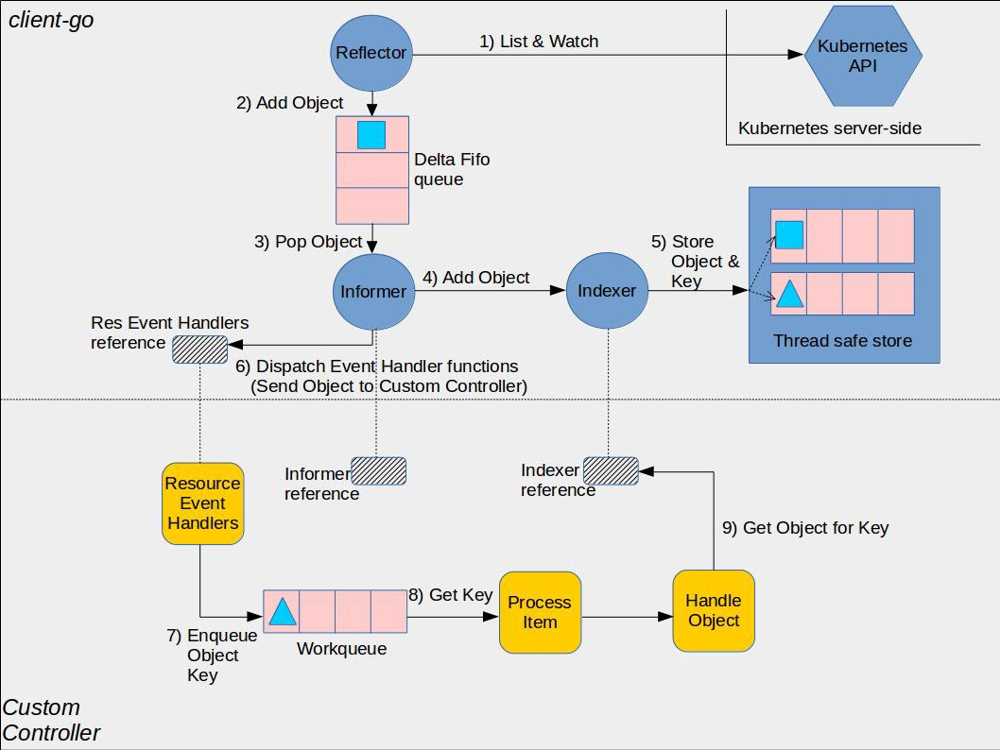

##  k8s: Custom Resource Definition


Custom Resource Definition 是kubernetes的资源扩展方式, 简称CRD


### 1. sample-controller 开源样板项目 

sample-controller 是 kubernetes 官方提供的 CRD Controller 样例实现

[sample-controller](https://github.com/kubernetes/sample-controller)


### 2. [使用client-go包访问Kubernetes CRD](https://aijishu.com/a/1060000000011204)

#### 2.1 create CRD
```yaml
apiVersion: "apiextensions.k8s.io/v1beta1"
kind: "CustomResourceDefinition"
metadata:
  name: "projects.example.sealyun.com"
spec:
  group: "example.sealyun.com"
  version: "v1alpha1"
  scope: "Namespaced"
  names:
    plural: "projects"
    singular: "project"
    kind: "Project"
  validation:
    openAPIV3Schema:
      required: ["spec"]
      properties:
        spec:
          required: ["replicas"]
          properties:
            replicas:
              type: "integer"
              minimum: 1
```

#### 2.2 create golang client
- define type
- define DeepCopy Method
> * Kubernetes API（在本例中为Project和ProjectList）提供的每种类型都需要实现该k8s.io/apimachinery/pkg/runtime.Object接口.
   该接口定义了两种方法GetObjectKind()和DeepCopyObject()。第一种方法已经由嵌入式metav1.TypeMeta结构提供; 第二个你必须自己实现。
- registry type
    schema.GroupVersion
    runtime.NewSchemeBuilder(addKnownTypes)
    SchemeBuilder.AddToScheme
    

### 3. Write your customer controller


注意: 这张图分为两部分,黄色图标是开发者需要自行开发的部分，而其它的部分是client-go已经提供的，直接使用即可。

1. 通过controller中的Reflector来实现监听，它通过kubernetes的List/Watch机制将得到事件(Object)写入到Stroe(Delta FIFO)中，
后续会基于该Delta FIFO实现完全按事件发生的顺序进行分发处理。

2. 由Reflector生产的事件最终由processor消费。processor通过POP队列(Delta FIFO)里的事件，更新本地的informer indexer缓存，
同时将事件distribute给所有的listener。

3. processer的listener由外部通过AddEventHandler注册，每个listener提供AddFunc, UpdateFunc, DeleteFunc方法。l
istener内部的实现加了一层缓存，用于存放pendingNotification。listener最终实现了事件的分发，事件最终被注册的handler处理。

4. 注册的handler可以根据事件的类型ADD,UPDATE,DELETE，将该事件的key(格式: namespace/resource_name)Enqueue到client-go
提供的Workqueue队列中。

5. 开发者需要实现自己的controller syncHandler(就是自己的核心逻辑)，从Workqueue中获取key，并通过这个key解析出namespace和
resource_name去调用Lister从indexer中获取该key对应的相应的元数据进行后续的逻辑处理。

上面就是开发者想要写一个controller(或者有的人也叫operator)的一个整体的流程。

#### 3.1 动手实践
download code generate
```bash
cd $GOPATH/src
mkdir -p k8s.io && cd k8s.io
git clone https://github.com/kubernetes/code-generator.git
```

download one template
```bash
cd $GOPATH/src/k8s.io
git clone https://github.com/xishengcai/example-controller.git
```

file struct
```bash
[root@cn-hongkong example-controller]# tree
.
├── hack
│   ├── boilerplate.go.txt
│   ├── update-codegen.sh
│   └── verify-codegen.sh
└── pkg
    └── apis
        └── examplecontroller
            ├── register.go
            └── v1
                ├── doc.go
                ├── register.go
                └── types.go

```
修改模板中的 group, version, object type， 然后使用脚本自动生成代码
```bash
./hack/update-codegen.sh
```
自动生成了 clientset，informers，listers 三个文件夹下的文件和apis下的zz_generated.deepcopy.go文件。

其中zz_generated.deepcopy.go中包含 pkg/apis/samplecontroller/v1alpha1/types.go 中定义的结构体的 DeepCopy() 方法。

另外三个文件夹clientset，informers，listers下都是 Kubernetes 生成的客户端库，在 controller 中会用到。

```
[root@cn-hongkong example-controller]# ./hack/update-codegen.sh
Generating deepcopy funcs
Generating clientset for examplecontroller:v1 at k8s.io/example-controller/pkg/generated/clientset
Generating listers for examplecontroller:v1 at k8s.io/example-controller/pkg/generated/listers
Generating informers for examplecontroller:v1 at k8s.io/example-controller/pkg/generated/informers
```

file struct
```
[root@cn-hongkong example-controller]# tree
.
├── hack
│   ├── boilerplate.go.txt
│   ├── update-codegen.sh
│   └── verify-codegen.sh
└── pkg
    ├── apis
    │   └── examplecontroller
    │       ├── register.go
    │       └── v1
    │           ├── doc.go
    │           ├── register.go
    │           ├── types.go
    │           └── zz_generated.deepcopy.go
    └── generated
        ├── clientset
        │   └── versioned
        │       ├── clientset.go
        │       ├── doc.go
        │       ├── fake
        │       │   ├── clientset_generated.go
        │       │   ├── doc.go
        │       │   └── register.go
        │       ├── scheme
        │       │   ├── doc.go
        │       │   └── register.go
        │       └── typed
        │           └── examplecontroller
        │               └── v1
        │                   ├── clustertesttype.go
        │                   ├── doc.go
        │                   ├── examplecontroller_client.go
        │                   ├── fake
        │                   │   ├── doc.go
        │                   │   ├── fake_clustertesttype.go
        │                   │   ├── fake_examplecontroller_client.go
        │                   │   └── fake_testtype.go
        │                   ├── generated_expansion.go
        │                   └── testtype.go
        ├── informers
        │   └── externalversions
        │       ├── examplecontroller
        │       │   ├── interface.go
        │       │   └── v1
        │       │       ├── clustertesttype.go
        │       │       ├── interface.go
        │       │       └── testtype.go
        │       ├── factory.go
        │       ├── generic.go
        │       └── internalinterfaces
        │           └── factory_interfaces.go
        └── listers
            └── examplecontroller
                └── v1
                    ├── clustertesttype.go
                    ├── expansion_generated.go
                    └── testtype.go

```


具体的controller 编写可以参考 https://github.com/kubernetes/sample-controller/blob/master/controller.go 
```go
//main.go
    // 创建k8s原生资源的client
	kubeClient, err := kubernetes.NewForConfig(cfg)
	if err != nil {
		klog.Fatalf("Error building kubernetes clientset: %s", err.Error())
	}

    // 创建自定义资源的client
	exampleClient, err := clientset.NewForConfig(cfg)
	if err != nil {
		klog.Fatalf("Error building example clientset: %s", err.Error())
	}
    
    // 生成informerFactrory
	kubeInformerFactory := kubeinformers.NewSharedInformerFactory(kubeClient, time.Second*30)
	exampleInformerFactory := informers.NewSharedInformerFactory(exampleClient, time.Second*30)
	
	controller := NewController(kubeClient, exampleClient,
		kubeInformerFactory.Apps().V1().Deployments(),
		exampleInformerFactory.Samplecontroller().V1alpha1().Foos())
    
    // 运行 Informer，Start 方法为非阻塞，会运行在单独的 goroutine 中
	kubeInformerFactory.Start(stopCh)
	exampleInformerFactory.Start(stopCh)

    // 多线程运行controller
	if err = controller.Run(2, stopCh); err != nil {
		klog.Fatalf("Error running controller: %s", err.Error())
	}

//controller.go
// Controller is the controller implementation for Foo resources
// NewController returns a new sample controller
func NewController(
	// 将 CRD 资源类型定义加入到 Kubernetes 的 Scheme 中，以便 Events 可以记录 CRD 的事件
	utilruntime.Must(samplescheme.AddToScheme(scheme.Scheme))
	eventBroadcaster.StartRecordingToSink(&typedcorev1.EventSinkImpl{Interface: kubeclientset.CoreV1().Events("")})
	 // 监听 CRD 类型'Foo'并注册 ResourceEventHandler 方法，当'Foo'的实例变化时进行处理
	fooInformer.Informer().AddEventHandler(cache.ResourceEventHandlerFuncs{
		AddFunc: controller.enqueueFoo,
		UpdateFunc: func(old, new interface{}) {
			controller.enqueueFoo(new)
		},
	})
	
    // 监听 Deployment 变化并注册 ResourceEventHandler 方法，
    // 当它的 ownerReferences 为 Foo 类型实例时，将该 Foo 资源加入 work queue
    deploymentInformer.Informer().AddEventHandler(cache.ResourceEventHandlerFuncs{
		AddFunc: controller.handleObject,
		UpdateFunc: func(old, new interface{}) {
			newDepl := new.(*appsv1.Deployment)
			oldDepl := old.(*appsv1.Deployment)
			if newDepl.ResourceVersion == oldDepl.ResourceVersion {
				return
			}
			controller.handleObject(new)
		},
		DeleteFunc: controller.handleObject,
	})

	return controller
}


func (c *Controller) Run(threadiness int, stopCh <-chan struct{}) error {
	defer utilruntime.HandleCrash()
	defer c.workqueue.ShutDown()
	
    // 在启动 worker 前等待缓存同步
	if ok := cache.WaitForCacheSync(stopCh, c.deploymentsSynced, c.foosSynced); !ok {
		return fmt.Errorf("failed to wait for caches to sync")
	}
	
    // 运行两个 worker 来处理资源
	for i := 0; i < threadiness; i++ {
		go wait.Until(c.runWorker, time.Second, stopCh)
	}
	<-stopCh
	return nil
}

func (c *Controller) runWorker() {
    // 无限循环，不断的调用 processNextWorkItem 处理下一个对象
	for c.processNextWorkItem() {
	}
}

func (c *Controller) processNextWorkItem() bool {
	obj, shutdown := c.workqueue.Get()

	if shutdown {
		return false
	}

	err := func(obj interface{}) error {
	    // 调用 workqueue.Done(obj) 方法告诉 workqueue 当前项已经处理完毕，
		defer c.workqueue.Done(obj)
		var key string
		var ok bool
		if key, ok = obj.(string); !ok {
			// 无效的项调用Forget方法，避免重新入队。
			c.workqueue.Forget(obj)
			utilruntime.HandleError(fmt.Errorf("expected string in workqueue but got %#v", obj))
			return nil
		}
		if err := c.syncHandler(key); err != nil {
			// 放回workqueue避免偶发的异常
			c.workqueue.AddRateLimited(key)
			return fmt.Errorf("error syncing '%s': %s, requeuing", key, err.Error())
		}
		c.workqueue.Forget(obj)
		klog.Infof("Successfully synced '%s'", key)
		return nil
	}(obj)

	if err != nil {
		utilruntime.HandleError(err)
		return true
	}

	return true
}

// 实现fool的副本数和期望值一致
func (c *Controller) syncHandler(key string) error {
	namespace, name, err := cache.SplitMetaNamespaceKey(key)
	if err != nil {
		utilruntime.HandleError(fmt.Errorf("invalid resource key: %s", key))
		return nil
	}

	foo, err := c.foosLister.Foos(namespace).Get(name)
	if err != nil {
		if errors.IsNotFound(err) {
			utilruntime.HandleError(fmt.Errorf("foo '%s' in work queue no longer exists", key))
			return nil
		}

		return err
	}

	deploymentName := foo.Spec.DeploymentName
	if deploymentName == "" {
		utilruntime.HandleError(fmt.Errorf("%s: deployment name must be specified", key))
		return nil
	}

	deployment, err := c.deploymentsLister.Deployments(foo.Namespace).Get(deploymentName)
	if errors.IsNotFound(err) {
		deployment, err = c.kubeclientset.AppsV1().Deployments(foo.Namespace).Create(newDeployment(foo))
	}
    //...

	if !metav1.IsControlledBy(deployment, foo) {
		msg := fmt.Sprintf(MessageResourceExists, deployment.Name)
		c.recorder.Event(foo, corev1.EventTypeWarning, ErrResourceExists, msg)
		return fmt.Errorf(msg)
	}

	if foo.Spec.Replicas != nil && *foo.Spec.Replicas != *deployment.Spec.Replicas {
		klog.V(4).Infof("Foo %s replicas: %d, deployment replicas: %d", name, *foo.Spec.Replicas, *deployment.Spec.Replicas)
		deployment, err = c.kubeclientset.AppsV1().Deployments(foo.Namespace).Update(newDeployment(foo))
	}
    
	err = c.updateFooStatus(foo, deployment)
    //....
	c.recorder.Event(foo, corev1.EventTypeNormal, SuccessSynced, MessageResourceSynced)
	return nil
}

func (c *Controller) updateFooStatus(foo *samplev1alpha1.Foo, deployment *appsv1.Deployment) error {
	fooCopy := foo.DeepCopy()
	fooCopy.Status.AvailableReplicas = deployment.Status.AvailableReplicas
	_, err := c.sampleclientset.SamplecontrollerV1alpha1().Foos(foo.Namespace).Update(fooCopy)
	return err
}

func (c *Controller) enqueueFoo(obj interface{}) {
	var key string
	var err error
	if key, err = cache.MetaNamespaceKeyFunc(obj); err != nil {
		utilruntime.HandleError(err)
		return
	}
	c.workqueue.Add(key)
}

func (c *Controller) handleObject(obj interface{}) {
	var object metav1.Object
	var ok bool
	if object, ok = obj.(metav1.Object); !ok {
		tombstone, ok := obj.(cache.DeletedFinalStateUnknown)
		if !ok {
			utilruntime.HandleError(fmt.Errorf("error decoding object, invalid type"))
			return
		}
		object, ok = tombstone.Obj.(metav1.Object)
		if !ok {
			utilruntime.HandleError(fmt.Errorf("error decoding object tombstone, invalid type"))
			return
		}
		klog.V(4).Infof("Recovered deleted object '%s' from tombstone", object.GetName())
	}
	klog.V(4).Infof("Processing object: %s", object.GetName())
	if ownerRef := metav1.GetControllerOf(object); ownerRef != nil {
		// If this object is not owned by a Foo, we should not do anything more
		// with it.
		if ownerRef.Kind != "Foo" {
			return
		}

		foo, err := c.foosLister.Foos(object.GetNamespace()).Get(ownerRef.Name)
		if err != nil {
			klog.V(4).Infof("ignoring orphaned object '%s' of foo '%s'", object.GetSelfLink(), ownerRef.Name)
			return
		}

		c.enqueueFoo(foo)
		return
	}
}

// .....
```
--- 以下是源码分析[原文 Kubernetes Client-Go Informer 实现源码剖析](https://xigang.github.io/2019/09/21/client-go/)-----
### 4. informer 

#### 4.1 Use SharedInformerFactory Create EventInformer
SharedInformerFactory为kubernetes中的所有资源(API group versions)提供了一个shared informer。所以controller中使用的所有Informer都是
从SharedInformerFactory中通过GroupVersionResource得到.

kubernetes 一共15个informer

SharedInformerFactory的声明结构:

```go
type SharedInformerFactory interface {
	internalinterfaces.SharedInformerFactory
	ForResource(resource schema.GroupVersionResource) (GenericInformer, error)
	WaitForCacheSync(stopCh <-chan struct{}) map[reflect.Type]bool

	Admissionregistration() admissionregistration.Interface
	Apps() apps.Interface
	Auditregistration() auditregistration.Interface
	Autoscaling() autoscaling.Interface
	Batch() batch.Interface
	Certificates() certificates.Interface
	Coordination() coordination.Interface
	Core() core.Interface
	Events() events.Interface
	Extensions() extensions.Interface
	Networking() networking.Interface
	Policy() policy.Interface
	Rbac() rbac.Interface
	Scheduling() scheduling.Interface
	Settings() settings.Interface
	Storage() storage.Interface
}
```

Events的声明结构:

```go
// Interface provides access to all the informers in this group version.
type Interface interface {
	// Events returns a EventInformer.
	Events() EventInformer
}
```

EventInformer的声明结构:

```go
// EventInformer provides access to a shared informer and lister for
// Events.
type EventInformer interface {
	Informer() cache.SharedIndexInformer
	Lister() v1beta1.EventLister
}
```

这样如果我们想使用EventInformer,那么我们就直接在SharedInformerFactory中获取我们需要的Informer即可。
只需要执行下面的两行代码:
```go
sharedInformers := informers.NewSharedInformerFactory(clientset, viper.GetDuration("resync-interval"))

eventsInformer := sharedInformers.Core().V1().Events()
```

#### 4.2 Register Informer
已经获取了我们想要使用的EventInformer，接下来就需要将该Informer注册到factory(SharedInformerFactory),
其实在调用eventsInformer.Informer()时，就已经做了Informer注册的工作,之后通过informerFactory.Start()
将所有注册到factory的Informer都启动。

下面是注册EventInformer的一个实现逻辑:
```go
func NewFilteredEventInformer(client kubernetes.Interface, namespace string, resyncPeriod time.Duration,
 indexers cache.Indexers, tweakListOptions internalinterfaces.TweakListOptionsFunc) cache.SharedIndexInformer {
	return cache.NewSharedIndexInformer(
		&cache.ListWatch{
			ListFunc: func(options metav1.ListOptions) (runtime.Object, error) {
				if tweakListOptions != nil {
					tweakListOptions(&options)
				}
				return client.CoreV1().Events(namespace).List(options)
			},
			WatchFunc: func(options metav1.ListOptions) (watch.Interface, error) {
				if tweakListOptions != nil {
					tweakListOptions(&options)
				}
				return client.CoreV1().Events(namespace).Watch(options)
			},
		},
		&corev1.Event{},
		resyncPeriod,
		indexers,
	)
}

func (f *eventInformer) defaultInformer(client kubernetes.Interface, resyncPeriod time.Duration) cache.SharedIndexInformer {
	return NewFilteredEventInformer(client, f.namespace, resyncPeriod, cache.Indexers{cache.NamespaceIndex: cache.MetaNamespaceIndexFunc}, f.tweakListOptions)
}

func (f *eventInformer) Informer() cache.SharedIndexInformer {
	return f.factory.InformerFor(&corev1.Event{}, f.defaultInformer)
}
```

sharedInformerFactory的声明结构, 在这里我们主要关注informers和startedInformers，其中informers主要的是存储，
向该factory已经注册的Informer,而startedInformers主要记录哪些Informer已经启动了。
```go
type sharedInformerFactory struct {
	client           kubernetes.Interface
	namespace        string
	tweakListOptions internalinterfaces.TweakListOptionsFunc
	lock             sync.Mutex
	defaultResync    time.Duration
	customResync     map[reflect.Type]time.Duration

	informers map[reflect.Type]cache.SharedIndexInformer
	// startedInformers is used for tracking which informers have been started.
	// This allows Start() to be called multiple times safely.
	startedInformers map[reflect.Type]bool
}
```

下面这段代码的逻辑是判断informer是否已经向factory注册完成，如果没有则进行注册操作。
```go
func (f *sharedInformerFactory) InformerFor(obj runtime.Object, newFunc internalinterfaces.NewInformerFunc) 
cache.SharedIndexInformer {
	f.lock.Lock()
	defer f.lock.Unlock()

	informerType := reflect.TypeOf(obj)
	informer, exists := f.informers[informerType]
	if exists {
		return informer
	}

	resyncPeriod, exists := f.customResync[informerType]
	if !exists {
		resyncPeriod = f.defaultResync
	}

	informer = newFunc(f.client, resyncPeriod)
	f.informers[informerType] = informer

	return informer
}
```

#### 4.3 Informer Run
最终informerFactory将注册到工厂的所有informer都启动,Informer主要的工作就是监听事件，并分发事件。
```go
// Start initializes all requested informers.
func (f *sharedInformerFactory) Start(stopCh <-chan struct{}) {
	f.lock.Lock()
	defer f.lock.Unlock()

	for informerType, informer := range f.informers {
		if !f.startedInformers[informerType] {
			go informer.Run(stopCh)
			f.startedInformers[informerType] = true
		}
	}
}
```

而WaitForCacheSync的作用主要是确认是否所有的Informer的都已经从kubernetes接收过事件，如果已经接收到事件，那么HasSynced会被设置为true
```go
// WaitForCacheSync waits for all started informers' cache were synced.
func (f *sharedInformerFactory) WaitForCacheSync(stopCh <-chan struct{}) map[reflect.Type]bool {
	informers := func() map[reflect.Type]cache.SharedIndexInformer {
		f.lock.Lock()
		defer f.lock.Unlock()

		informers := map[reflect.Type]cache.SharedIndexInformer{}
		for informerType, informer := range f.informers {
			if f.startedInformers[informerType] {
				informers[informerType] = informer
			}
		}
		return informers
	}()

	res := map[reflect.Type]bool{}
	for informType, informer := range informers {
		res[informType] = cache.WaitForCacheSync(stopCh, informer.HasSynced)
	}
	return res
}
```

#### 4.4 sharedIndexInformer
informer作为异步事件处理框架，完成了事件监听和分发处理两个过程，sharedIndexInformer的声明结构，该结构就是代表了一个Informer实例。
```go
type sharedIndexInformer struct {
	indexer               Indexer
	controller            Controller

	processor             *sharedProcessor
	cacheMutationDetector CacheMutationDetector

	// This block is tracked to handle late initialization of the controller
	listerWatcher ListerWatcher
	objectType    runtime.Object

	// resyncCheckPeriod is how often we want the reflector's resync timer to fire so it can call
	// shouldResync to check if any of our listeners need a resync.
	resyncCheckPeriod time.Duration
	// defaultEventHandlerResyncPeriod is the default resync period for any handlers added via
	// AddEventHandler (i.e. they don't specify one and just want to use the shared informer's default
	// value).
	defaultEventHandlerResyncPeriod time.Duration
	// clock allows for testability
	clock clock.Clock

	started, stopped bool
	startedLock      sync.Mutex

	// blockDeltas gives a way to stop all event distribution so that a late event handler
	// can safely join the shared informer.
	blockDeltas sync.Mutex
}
```

首先来看indexer成员，该成员indexer是一个保存全量数据的缓存Store。 Informer对外提供的Lister就是直接从Store获取的数据，而没有直接操作etcd。

#### 4.5 indexer的声明结构:

```go
// Indexer is a storage interface that lets you list objects using multiple indexing functions
type Indexer interface {
	Store
	math
	Index(indexName string, obj interface{}) ([]interface{}, error)
	math
	IndexKeys(indexName, indexKey string) ([]string, error)
	// ListIndexFuncValues returns the list of generated values of an Index func
	ListIndexFuncValues(indexName string) []string
	math
	ByIndex(indexName, indexKey string) ([]interface{}, error)
	// GetIndexer return the indexers
	GetIndexers() Indexers

	// AddIndexers adds more indexers to this store.  If you call this after you already have data
	// in the store, the results are undefined.
	AddIndexers(newIndexers Indexers) error
}
```

下面这个代码片段是启动一个Informer实例，需要做的处理逻辑。接下来，让我们分析下这部分处理逻辑的各个细节部分。

```go
func (s *sharedIndexInformer) Run(stopCh <-chan struct{}) {
    	defer utilruntime.HandleCrash()

	fifo := NewDeltaFIFO(MetaNamespaceKeyFunc, s.indexer)

	cfg := &Config{
		Queue:            fifo,
		ListerWatcher:    s.listerWatcher,
		ObjectType:       s.objectType,
		FullResyncPeriod: s.resyncCheckPeriod,
		RetryOnError:     false,
		ShouldResync:     s.processor.shouldResync,

		Process: s.HandleDeltas,
	}

	func() {
		s.startedLock.Lock()
		defer s.startedLock.Unlock()

		s.controller = New(cfg)
		s.controller.(*controller).clock = s.clock
		s.started = true
	}()

	// Separate stop channel because Processor should be stopped strictly after controller
	processorStopCh := make(chan struct{})
	var wg wait.Group
	defer wg.Wait()              // Wait for Processor to stop
	defer close(processorStopCh) // Tell Processor to stop
	wg.StartWithChannel(processorStopCh, s.cacheMutationDetector.Run)
	wg.StartWithChannel(processorStopCh, s.processor.run)

	defer func() {
		s.startedLock.Lock()
		defer s.startedLock.Unlock()
		s.stopped = true // Don't want any new listeners
	}()
	s.controller.Run(stopCh)
}
```

#### 4.6 DeltaFIFO

首先创建一个DeltaFIFO实例对象，该实例对象的声明结构:

```go
type DeltaFIFO struct {
	// lock/cond protects access to 'items' and 'queue'.
	lock sync.RWMutex
	cond sync.Cond

	// We depend on the property that items in the set are in
	// the queue and vice versa, and that all Deltas in this
	// map have at least one Delta.
	items map[string]Deltas
	queue []string

	// populated is true if the first batch of items inserted by Replace() has been populated
	// or Delete/Add/Update was called first.
	populated bool
	// initialPopulationCount is the number of items inserted by the first call of Replace()
	initialPopulationCount int

	// keyFunc is used to make the key used for queued item
	// insertion and retrieval, and should be deterministic.
	keyFunc KeyFunc

	// knownObjects list keys that are "known", for the
	// purpose of figuring out which items have been deleted
	// when Replace() or Delete() is called.
	knownObjects KeyListerGetter

	// Indication the queue is closed.
	// Used to indicate a queue is closed so a control loop can exit when a queue is empty.
	// Currently, not used to gate any of CRED operations.
	closed     bool
	closedLock sync.Mutex
}
```

在Informer中,DeltaFIFO作为Reflector的Store,根据List/Watch的结果对Store进行ADD,UPDATE,DELETE操作。在Delta的声明结构中，
最重要的就是两个成员iterms和queue。iterms成员缓存了所有添加到Store中的事件，而queue则存储这些事件的id作为FIFO处理的先后顺序。
而populated和initialPopulationCount两个成员主要当Store被首次初始化完成之后，会被设置为true。

iterms的声明结构:

```go
const (
	Added   DeltaType = "Added"
	Updated DeltaType = "Updated"
	Deleted DeltaType = "Deleted"
	// The other types are obvious. You'll get Sync deltas when:
	//  * A watch expires/errors out and a new list/watch cycle is started.
	//  * You've turned on periodic syncs.
	// (Anything that trigger's DeltaFIFO's Replace() method.)
	Sync DeltaType = "Sync"
)

// Delta is the type stored by a DeltaFIFO. It tells you what change
// happened, and the object's state after* that change.
//
// [*] Unless the change is a deletion, and then you'll get the final
//     state of the object before it was deleted.
type Delta struct {
	Type   DeltaType
	Object interface{}
}

// Deltas is a list of one or more 'Delta's to an individual object.
// The oldest delta is at index 0, the newest delta is the last one.
type Deltas []Delta
```


### 4.7 Controller

当初始化DeltaFIFO实例之后，就对controller的Config进行初始化操作,Config的声明结构:
```go
// Config contains all the settings for a Controller.
type Config struct {
	// The queue for your objects - has to be a DeltaFIFO due to
	// assumptions in the implementation. Your Process() function
	// should accept the output of this Queue's Pop() method.
	Queue

	// Something that can list and watch your objects.
	ListerWatcher

	// Something that can process your objects.
	Process ProcessFunc

	// The type of your objects.
	ObjectType runtime.Object

	// Reprocess everything at least this often.
	// Note that if it takes longer for you to clear the queue than this
	// period, you will end up processing items in the order determined
	// by FIFO.Replace(). Currently, this is random. If this is a
	// problem, we can change that replacement policy to append new
	// things to the end of the queue instead of replacing the entire
	// queue.
	FullResyncPeriod time.Duration

	// ShouldResync, if specified, is invoked when the controller's reflector determines the next
	// periodic sync should occur. If this returns true, it means the reflector should proceed with
	// the resync.
	ShouldResync ShouldResyncFunc

	// If true, when Process() returns an error, re-enqueue the object.
	// TODO: add interface to let you inject a delay/backoff or drop
	//       the object completely if desired. Pass the object in
	//       question to this interface as a parameter.
	RetryOnError bool
}
```

对Config中的主要成员进行介绍下，方便之后介绍controller的时候方便了解。

- Queue: DeltaFIFO事件处理队列，之后Queue的POP方法会从该队列中不断的POP数据给Process()方法去处理。
- ListerWatcher: 用于List/Watch关心的kubernetes资源对象。
- Process: 就是处理从DeltaFIFO中POP出来的数据，这个具体的实现后续会介绍到。
最终对Config初始化完成之后，赋值给sharedIndexInformer的controller成员。

Controller的Run主要是一个生产者消费者模式，reflector是生产者，为controller中的Process方法Process: 
s.HandleDeltas是消费者。而processLoop会循环的从Queue(DeltaFIFO)中POP事件数据给s.HandleDeltas去处理。

Controller Run的代码片段如下:
```go
// Run begins processing items, and will continue until a value is sent down stopCh.
// It's an error to call Run more than once.
// Run blocks; call via go.
func (c *controller) Run(stopCh <-chan struct{}) {
	defer utilruntime.HandleCrash()
	go func() {
		<-stopCh
		c.config.Queue.Close()
	}()
	r := NewReflector(
		c.config.ListerWatcher,
		c.config.ObjectType,
		c.config.Queue,
		c.config.FullResyncPeriod,
	)
	r.ShouldResync = c.config.ShouldResync
	r.clock = c.clock

	c.reflectorMutex.Lock()
	c.reflector = r
	c.reflectorMutex.Unlock()

	var wg wait.Group
	defer wg.Wait()

	wg.StartWithChannel(stopCh, r.Run)

	wait.Until(c.processLoop, time.Second, stopCh)
}
```

在上面的这段代码片段中，首先会先启动reflector来List/Watch我们所关心的资源，并将其添加到Store(DeltaFIFO)中。具体的实现逻辑如下:

```go
// Reflector watches a specified resource and causes all changes to be reflected in the given store.
type Reflector struct {
	// name identifies this reflector. By default it will be a file:line if possible.
	name string
	// metrics tracks basic metric information about the reflector
	metrics *reflectorMetrics

	// The type of object we expect to place in the store.
	expectedType reflect.Type
	// The destination to sync up with the watch source
	store Store
	// listerWatcher is used to perform lists and watches.
	listerWatcher ListerWatcher
	// period controls timing between one watch ending and
	// the beginning of the next one.
	period       time.Duration
	resyncPeriod time.Duration
	ShouldResync func() bool
	// clock allows tests to manipulate time
	clock clock.Clock
	// lastSyncResourceVersion is the resource version token last
	// observed when doing a sync with the underlying store
	// it is thread safe, but not synchronized with the underlying store
	lastSyncResourceVersion string
	// lastSyncResourceVersionMutex guards read/write access to lastSyncResourceVersion
	lastSyncResourceVersionMutex sync.RWMutex
}
```

对Reflector对象的初始化逻辑如下:
```go
func NewReflector(lw ListerWatcher, expectedType interface{}, store Store, resyncPeriod time.Duration) *Reflector {
	return NewNamedReflector(naming.GetNameFromCallsite(internalPackages...), lw, expectedType, store, resyncPeriod)
}

// NewNamedReflector same as NewReflector, but with a specified name for logging
func NewNamedReflector(name string, lw ListerWatcher, expectedType interface{}, store Store, resyncPeriod time.Duration) *Reflector {
	reflectorSuffix := atomic.AddInt64(&reflectorDisambiguator, 1)
	r := &Reflector{
		name: name,
		// we need this to be unique per process (some names are still the same) but obvious who it belongs to
		metrics:       newReflectorMetrics(makeValidPrometheusMetricLabel(fmt.Sprintf("reflector_"+name+"_%d", reflectorSuffix))),
		listerWatcher: lw,
		store:         store,
		expectedType:  reflect.TypeOf(expectedType),
		period:        time.Second,
		resyncPeriod:  resyncPeriod,
		clock:         &clock.RealClock{},
	}
	return r
}
```

当Reflector初始化完成之后，则启动Reflector来让它去帮助你去List/Watch工作。具体的启动实现逻辑如下:
```go
// Run starts a watch and handles watch events. Will restart the watch if it is closed.
// Run will exit when stopCh is closed.
func (r *Reflector) Run(stopCh <-chan struct{}) {
	klog.V(3).Infof("Starting reflector %v (%s) from %s", r.expectedType, r.resyncPeriod, r.name)
	wait.Until(func() {
		if err := r.ListAndWatch(stopCh); err != nil {
			utilruntime.HandleError(err)
		}
	}, r.period, stopCh)
}
```

上面这段代码的核心就是通过r.ListAndWatch方法去List/Watch。由于r.ListAndWatch实现逻辑太长，就简单的说下它的实现逻辑,这个方法主要做两件事儿:

- list所有关心的资源对象，并将对象存储到Store中。
- watch所关心的资源对象, 并判断对象是否已经存在Store,如果存在则UPDATE,否则添加，或者删除。
- ok,这样现在通过Reflector这个生产者，我们就把我们所关心的资源对象添加到Store(DeltaFIFO)中了。接下来通过我们的Process方法来从Queue中POP出事件数据，进行消费处理。

processLoop的处理逻辑代码片段如下:
```go
func (c *controller) processLoop() {
	for {
		obj, err := c.config.Queue.Pop(PopProcessFunc(c.config.Process))
		if err != nil {
			if err == FIFOClosedError {
				return
			}
			if c.config.RetryOnError {
				// This is the safe way to re-enqueue.
				c.config.Queue.AddIfNotPresent(obj)
			}
		}
	}
}
```

process会不断的从Queue中POP事件数据给c.config.Process消费。如果在消费的过程中出现错误的情况，则还会重新的把数据重新加回到queue队列中。

queue.POP方法的实现逻辑如下:

```go
func (f *DeltaFIFO) Pop(process PopProcessFunc) (interface{}, error) {
	f.lock.Lock()
	defer f.lock.Unlock()
	for {
		for len(f.queue) == 0 {
			// When the queue is empty, invocation of Pop() is blocked until new item is enqueued.
			// When Close() is called, the f.closed is set and the condition is broadcasted.
			// Which causes this loop to continue and return from the Pop().
			if f.IsClosed() {
				return nil, FIFOClosedError
			}

			f.cond.Wait()
		}
		id := f.queue[0]
		f.queue = f.queue[1:]
		if f.initialPopulationCount > 0 {
			f.initialPopulationCount--
		}
		item, ok := f.items[id]
		if !ok {
			// Item may have been deleted subsequently.
			continue
		}
		delete(f.items, id)
		err := process(item)
		if e, ok := err.(ErrRequeue); ok {
			f.addIfNotPresent(id, item)
			err = e.Err
		}
		// Don't need to copyDeltas here, because we're transferring
		// ownership to the caller.
		return item, err
	}
}
```

c.config.Process(就是HandleDeltas)方法的处理逻辑如下:
```go
func (s *sharedIndexInformer) HandleDeltas(obj interface{}) error {
	s.blockDeltas.Lock()
	defer s.blockDeltas.Unlock()

	// from oldest to newest
	for _, d := range obj.(Deltas) {
		switch d.Type {
		case Sync, Added, Updated:
			isSync := d.Type == Sync
			s.cacheMutationDetector.AddObject(d.Object)
			if old, exists, err := s.indexer.Get(d.Object); err == nil && exists {
				if err := s.indexer.Update(d.Object); err != nil {
					return err
				}
				s.processor.distribute(updateNotification{oldObj: old, newObj: d.Object}, isSync)
			} else {
				if err := s.indexer.Add(d.Object); err != nil {
					return err
				}
				s.processor.distribute(addNotification{newObj: d.Object}, isSync)
			}
		case Deleted:
			if err := s.indexer.Delete(d.Object); err != nil {
				return err
			}
			s.processor.distribute(deleteNotification{oldObj: d.Object}, false)
		}
	}
	return nil
}
```


每当从Queue队列中POP出新的事件数据时，都会被上面的这个方法处理，首先会根据元素的处理类型,来决定具体的处理逻辑:

下面是每个事件元素能够被处理的时间类型:
```go
const (
	Added   DeltaType = "Added"
	Updated DeltaType = "Updated"
	Deleted DeltaType = "Deleted"
	// The other types are obvious. You'll get Sync deltas when:
	//  * A watch expires/errors out and a new list/watch cycle is started.
	//  * You've turned on periodic syncs.
	// (Anything that trigger's DeltaFIFO's Replace() method.)
	Sync DeltaType = "Sync"
)
```

如果是Sync,ADD,Updated,DELETE则相应的处理逻辑如下:

1.如果是ADD类型，则直接将新添加的元素ADD到Store中，之后进行事件的分发distribute操作。
2.如果是UPDATED类型，则从Store中获取该元素，并更新Store中的元素，之后进行事件的分发distribute操作。
3.如果是DELETE类型，则直接从Store中删除元素，之后也是进行事件的分发distribute操作。


sharedProcessor
接下来我们在对sharedProcessor的事件分发处理进行详细的介绍。在消费事件时，通过informer的processer进行distrubute。processer进行分发的处理函数由外部的AddEventHandler向processer里addListener。其中addListener只是添加一个processer管理listeners,并在分发时遍历listeners，将事件发送给所有的listener。

sharedProcessor的声明结构如下:

```go
type sharedProcessor struct {
	listenersStarted bool
	listenersLock    sync.RWMutex
	listeners        []*processorListener
	syncingListeners []*processorListener
	clock            clock.Clock
	wg               wait.Group
}

func (p *sharedProcessor) addListener(listener *processorListener) {
	p.listenersLock.Lock()
	defer p.listenersLock.Unlock()

	p.addListenerLocked(listener)
	if p.listenersStarted {
		p.wg.Start(listener.run)
		p.wg.Start(listener.pop)
	}
}

func (p *sharedProcessor) distribute(obj interface{}, sync bool) {
	p.listenersLock.RLock()
	defer p.listenersLock.RUnlock()

	if sync {
		for _, listener := range p.syncingListeners {
			listener.add(obj)
		}
	} else {
		for _, listener := range p.listeners {
			listener.add(obj)
		}
	}
}
```

processor的run保证所有listener都开始运行，并保证退出时所有listener的chan都关闭。
```go
func (p *sharedProcessor) run(stopCh <-chan struct{}) {
	func() {
		p.listenersLock.RLock()
		defer p.listenersLock.RUnlock()
		for _, listener := range p.listeners {
			p.wg.Start(listener.run)
			p.wg.Start(listener.pop)
		}
		p.listenersStarted = true
	}()
	<-stopCh
	p.listenersLock.RLock()
	defer p.listenersLock.RUnlock()
	for _, listener := range p.listeners {
		close(listener.addCh) // Tell .pop() to stop. .pop() will tell .run() to stop
	}
	p.wg.Wait() // Wait for all .pop() and .run() to stop
}
```

processorListener
```go
type processorListener struct {
	nextCh chan interface{}
	addCh  chan interface{}

	handler ResourceEventHandler

	// pendingNotifications is an unbounded ring buffer that holds all notifications not yet distributed.
	// There is one per listener, but a failing/stalled listener will have infinite pendingNotifications
	// added until we OOM.
	// TODO: This is no worse than before, since reflectors were backed by unbounded DeltaFIFOs, but
	// we should try to do something better.
	pendingNotifications buffer.RingGrowing

	// requestedResyncPeriod is how frequently the listener wants a full resync from the shared informer
	requestedResyncPeriod time.Duration
	// resyncPeriod is how frequently the listener wants a full resync from the shared informer. This
	// value may differ from requestedResyncPeriod if the shared informer adjusts it to align with the
	// informer's overall resync check period.
	resyncPeriod time.Duration
	// nextResync is the earliest time the listener should get a full resync
	nextResync time.Time
	// resyncLock guards access to resyncPeriod and nextResync
	resyncLock sync.Mutex
}
```

pendingNotifications装了所有还没分发的事件。而handler则是开发者向Informer注册的ResourceEventHandler
```go
type processorListener struct {
	nextCh chan interface{}
	addCh  chan interface{}

	handler ResourceEventHandler

	// pendingNotifications is an unbounded ring buffer that holds all notifications not yet distributed.
	// There is one per listener, but a failing/stalled listener will have infinite pendingNotifications
	// added until we OOM.
	// TODO: This is no worse than before, since reflectors were backed by unbounded DeltaFIFOs, but
	// we should try to do something better.
	pendingNotifications buffer.RingGrowing

	// requestedResyncPeriod is how frequently the listener wants a full resync from the shared informer
	requestedResyncPeriod time.Duration
	// resyncPeriod is how frequently the listener wants a full resync from the shared informer. This
	// value may differ from requestedResyncPeriod if the shared informer adjusts it to align with the
	// informer's overall resync check period.
	resyncPeriod time.Duration
	// nextResync is the earliest time the listener should get a full resync
	nextResync time.Time
	// resyncLock guards access to resyncPeriod and nextResync
	resyncLock sync.Mutex
}
```

pendingNotifications装了所有还没分发的事件。而handler则是开发者向Informer注册的ResourceEventHandler。
```go
type ResourceEventHandler interface {
	OnAdd(obj interface{})
	OnUpdate(oldObj, newObj interface{})
	OnDelete(obj interface{})
}
```

而ResourceEventHandler这个接口被ResourceEventHandlerFuncs结构已经实现了，开发者去实现下面的AddFunc,
 UpdateFunc, DeleteFunc并注册到Informer即可。
 ```go
type ResourceEventHandlerFuncs struct {
	AddFunc    func(obj interface{})
	UpdateFunc func(oldObj, newObj interface{})
	DeleteFunc func(obj interface{})
}
 ```

接下来继续，其中处理事件processor开始distribute时，会调用listener的add方法，将事件发到addCh上
```go
func (p *processorListener) add(notification interface{}) {
	p.addCh <- notification
}
```

listener的pop goroutine不断地从addCh中获取事件，写到本地的pendingNotification或写给nextCh，而nextCh从本地pendingNotification或addCh获取事件。最后由run方法消费事件和分发事件。run方法支持指数重试，退出也会重新开始。
```go
func (p *processorListener) pop() {
	defer utilruntime.HandleCrash()
	defer close(p.nextCh) // Tell .run() to stop

	var nextCh chan<- interface{}
	var notification interface{}
	for {
		select {
		case nextCh <- notification:
			// Notification dispatched
			var ok bool
			notification, ok = p.pendingNotifications.ReadOne()
			if !ok { // Nothing to pop
				nextCh = nil // Disable this select case
			}
		case notificationToAdd, ok := <-p.addCh:
			if !ok {
				return
			}
			if notification == nil { // No notification to pop (and pendingNotifications is empty)
				// Optimize the case - skip adding to pendingNotifications
				notification = notificationToAdd
				nextCh = p.nextCh
			} else { // There is already a notification waiting to be dispatched
				p.pendingNotifications.WriteOne(notificationToAdd)
			}
		}
	}
}

func (p *processorListener) run() {
	// this call blocks until the channel is closed.  When a panic happens during the notification
	// we will catch it, **the offending item will be skipped!**, and after a short delay (one second)
	// the next notification will be attempted.  This is usually better than the alternative of never
	// delivering again.
	stopCh := make(chan struct{})
	wait.Until(func() {
		// this gives us a few quick retries before a long pause and then a few more quick retries
		err := wait.ExponentialBackoff(retry.DefaultRetry, func() (bool, error) {
			for next := range p.nextCh {
				switch notification := next.(type) {
				case updateNotification:
					p.handler.OnUpdate(notification.oldObj, notification.newObj)
				case addNotification:
					p.handler.OnAdd(notification.newObj)
				case deleteNotification:
					p.handler.OnDelete(notification.oldObj)
				default:
					utilruntime.HandleError(fmt.Errorf("unrecognized notification: %#v", next))
				}
			}
			// the only way to get here is if the p.nextCh is empty and closed
			return true, nil
		})

		// the only way to get here is if the p.nextCh is empty and closed
		if err == nil {
			close(stopCh)
		}
	}, 1*time.Minute, stopCh)
}
```

这样就对Store中的事件数据进行了分发，如果开发者想要实现自己的custom controller的话，可以在分发之后，
将分发后的数据写入到client-go提供的Workqueue队列中，并在自己实现的syncHandler实现逻辑中不断的中Workqueue中去获取key,然后去实现自己的逻辑。


#### Link
- https://zhuanlan.zhihu.com/p/59660536

- [原文 Kubernetes Client-Go Informer 实现源码剖析](https://xigang.github.io/2019/09/21/client-go/)
- [自己构建一个 k8s sample-controller.](https://www.cnblogs.com/maoqide/p/11254937.html)
- [Kubernetes Deep Dive: Code Generation for CustomResources](https://blog.openshift.com/kubernetes-deep-dive-code-generation-customresources/)
- [深入浅出kubernetes之client-go的SharedInformerFactory](https://blog.csdn.net/weixin_42663840/article/details/81980022)
- [kubernetes.io/crd](https://kubernetes.io/docs/tasks/access-kubernetes-api/custom-resources/custom-resource-definitions/)
