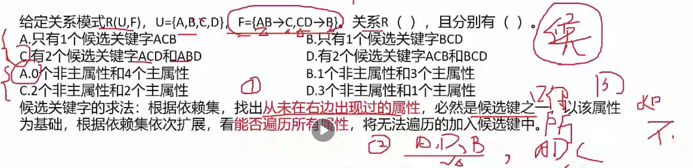
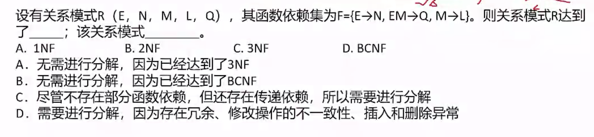

# 数据库-范式

### 相关概念

**超键**： 能唯一标示一张表

**候选键**：删除 超键 中的冗余属性，就是候选键；候选键可能不止一组

**主属性**：候选键中的任意一个属性

### 关系代数

笛卡尔积：`$A \times $B`， 行数（Ra*Rb）， 列数（Ca+Cb）

自然连接：`$A \Join B` 行数（保留主键值相同的），列数（A∪B)

[专门的关系运算](https://blog.csdn.net/weixin_44298385/article/details/103057925)：

- 投影（对关系进行垂直分割——对列的操作）
- 选择（对关系进行水平分割——对行的操作）
- 连接（关系之间的结合）
- 除法（笛卡尔积的逆运算）

下面的表格更加直观的介绍关系代数的分类，并对其进行了简单的分类

### 范式

**第一范式：**表中不能有子表

**第二范式：**非主属性不存在 **部分依赖** （A,B ---> C, B ----> C)

**第三范式：**非主属性不存在 **传递依赖** ( A ---->B, B ---> C)

**BC范式：** 主属性不存在 传递依赖 

​	典型例子：依赖集  （SJ--->T, T--->J）

​	可以推理出 **候选键** 有S，J 或 S，T； 

​    主属性： S，J ， T

​	1）当候选键是 S， T 的时候，T 可以推出 J， SJ 可以推出 T； （可以看出 T 和 S 都在 依赖关系的左边）

​	2）当候选键是 S， J 的时候， 其中T -->J 的依赖关系中T， 在左边，但是T 不在候选键中，就是说T 依赖于其他主属性（**暂时就这么理解，其实我也不知道**）

### 真题练习

答案：C， A

候选键： E，M

非主属性：N， L， Q

N 依赖 E，但是不依赖M， 属于部分依赖

答案：A， D

