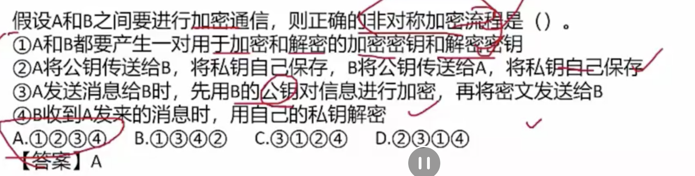

# 系统安全

## 1. 基础知识

### 5个基本要素

- 1）机密性
- 2）完整性
- 3）可用性
- 4）可控性
- 5）可审查性

### 信息安全的范围

- 1）设备安全
- 2）数据安全
- 3）内容安全
- 4）行为安全

### 信息存储安全

- 1）信息使用安全
- 2）系统安全监控
- 3）病毒防范

### 网络安全

- 体现
- 威胁
- 措施

## 2. 信息系统安全的组成框架

### 技术体系

- 基础设备
- 网络安全
- 操作系统安全
- 数据库安全
- 终端设备

## 3. 信息安全技术

### 对称加密技术

DES：替换+移位，56位密钥，64位数据块、速度快，密钥容易产生

3DES：3重DES，两个56位密钥 k1,k2

​			加密： k1 加密 --> k2 解密 --> k1 加密

​			解密： k1 解密 --> k2加密 --> k1 解密

AES

RC-5

IDEA

### 非对称加密

RSA

Elgamal, ECC(椭圆曲线算法)、背包算法，Rabin，D-H

### 数字信封原理

### 信息摘要

### 数字签名：唯一标识一个发送方

### 公钥基础设施PKI

- 数字证书
- 签证机构

### 访问控制

- 访问控制矩阵
- 访问控制表
- 能力表
- 授权关系表

## 4.信息安全的抗攻击技术

