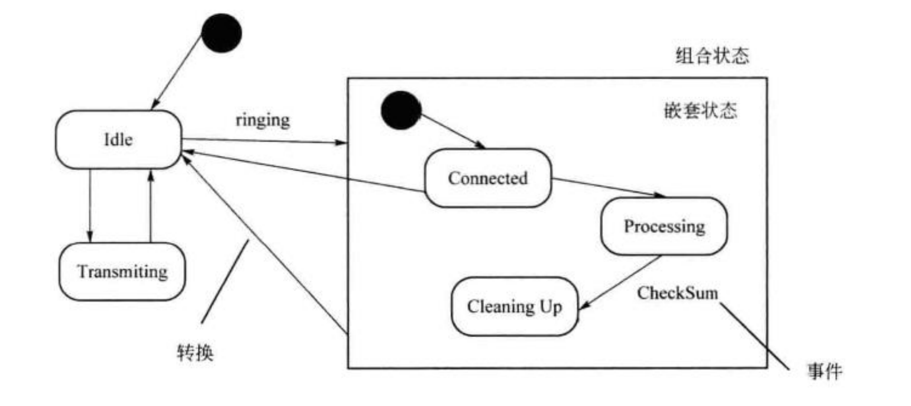
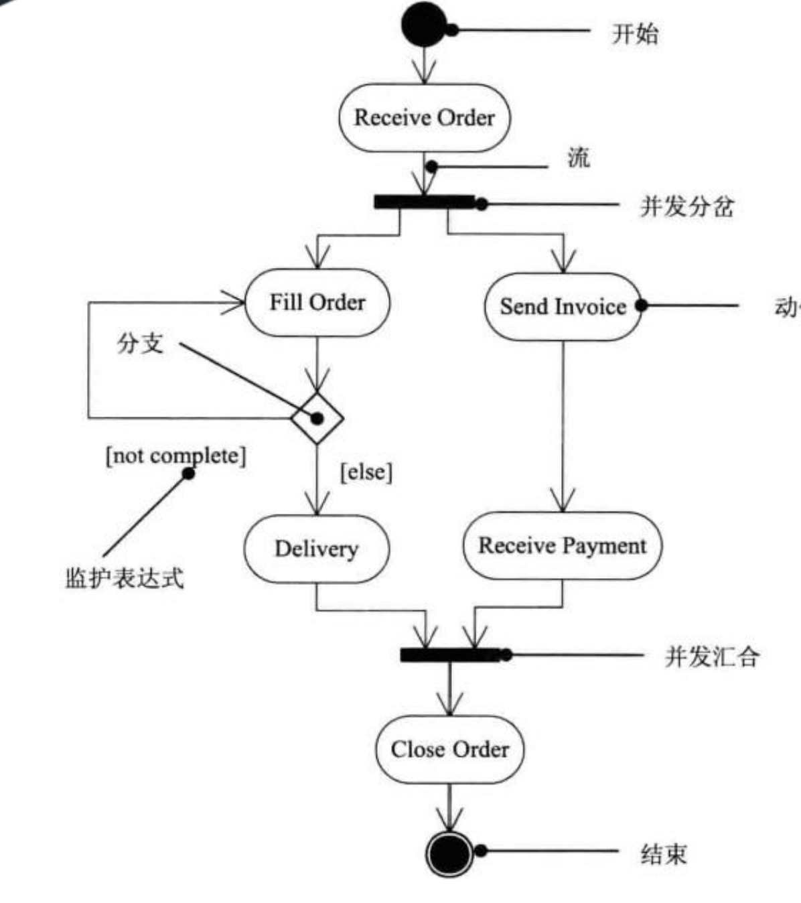

# 面向对象系统建模

历史 考察 3- 5 分（设计模式，UML）

## 基础概念

对象

类

抽象

封装

继承

多态

接口

消息

覆盖

函数重载： 函数名相同，参数不同

绑定

## 面向对象分析模型

面向对象基础

分析设计

类之间的关系

关联(Association)

聚合（Aggregation）：有共同的生命周期

组合（Composition）：没有共同生命周期

泛化（generalization）：子类 父类

依赖（Dependence）： 人依赖空气

### 用例图3种关系：

包含： 上课前 必须登陆

扩展： 发现欠费，需先缴费

泛化： 子类与父类

状态图

活动图

数据流流图在分层细化的数据平衡原则：

1）子图与父图之间的平衡

- 父图与子图之间的平衡是指任何一张DFD子图边界上的 输入/输出 数据流必须与父图对应加工的 输入/输出 数据流保持一致
- 如果父图中某个加工的一条数据流对应于子图中的几条数据流，而子图中组成这些数据流的数据项全体正好等于父图中的这条数据流，那么他们仍然是平衡的

2）子图内部：加工的输入和输出需要平衡

master  4C， 8G

Node1:  8C， 16G

Node2:  8C， 16G

Node3:  8C，16G
